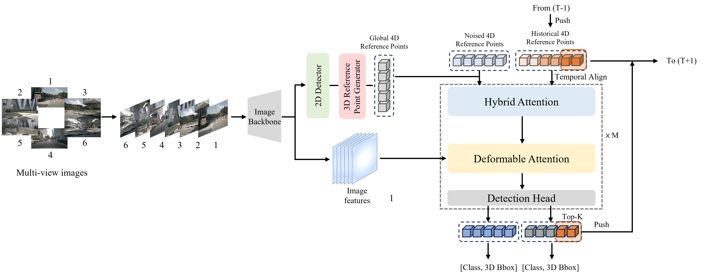

<div align="center">
<h1>Efficient Deformable Modeling Network for Multi-View 3D Object Detection</h1>
</div>

<div align="center">
  
</div><br/>

## Publication: Efficient Deformable Modeling Network for Multi-view 3D Object Detection, Neural Computing and Applications (Springer Nature), vol. 38, article number 122 (https://doi.org/10.1007/s00521-026-11881-y), Feb. 14, 2026

## Getting Started

Our implementation is based on [StreamPETR](https://github.com/exiawsh/StreamPETR). Please follow [Environment Setup](https://github.com/exiawsh/StreamPETR/blob/main/docs/setup.md) and [Data Preparation](https://github.com/exiawsh/StreamPETR/blob/main/docs/data_preparation.md) step by step.

## Train & Inference

### Train
```bash
tools/dist_train.sh projects/configs/RepDETR4D/repdetr4d_res50_706_bs16_seq_60e.py 4 --work-dir work_dirs/RepDETR4D/
```
### Evaluation

```bash
tools/dist_test.sh projects/configs/RepDETR4D/repdetr4d_res50_706_bs16_seq_60e.py work_dirs/RepDETR4D/latest.pth 4 --eval bbox
```

## Results on NuScenes Val Set.
| Model | Setting |Pretrain| Lr Schd | NDS| mAP|Config |Weight|
| :---: | :---: | :---: | :---: | :---:| :---: | :---:| :---:|
|StreamPETR| R18 | ImageNet | 60ep | 48.4 | 36.2 |-|-|
|RepPETR4D| R18 | ImageNet | 60ep | 50.0 | 37.8 |[config](https://github.com/smu-ivpl/RepPETR4D/blob/main/projects/configs/RepPETR4D/repdetr4d_res18_706_bs16_seq_60e.py)|[weight](https://drive.google.com/file/d/1OsJswU9DEIFFtYtKv_UCWA7XQGCEjKMd/view?usp=drive_link)|
|StreamPETR| R50 | [NuImg](https://download.openmmlab.com/mmdetection3d/v0.1.0_models/nuimages_semseg/cascade_mask_rcnn_r50_fpn_coco-20e_20e_nuim/cascade_mask_rcnn_r50_fpn_coco-20e_20e_nuim_20201009_124951-40963960.pth) | 60ep | 54.5 |44.9 |-|
|RepPETR4D| R50 | [NuImg](https://download.openmmlab.com/mmdetection3d/v0.1.0_models/nuimages_semseg/cascade_mask_rcnn_r50_fpn_coco-20e_20e_nuim/cascade_mask_rcnn_r50_fpn_coco-20e_20e_nuim_20201009_124951-40963960.pth) | 60ep | 55.1 |45.5 |[config](https://github.com/smu-ivpl/RepPETR4D/blob/main/projects/configs/RepDETR4D/repdetr4d_res50_706_bs16_seq_60e.py)|[weight](https://drive.google.com/file/d/1PSjde0zz5Xw8BSRXWhE9BnC8akLV_oB_/view?usp=drive_link)|


## Results on NuScenes Test Set.
| Model | Setting |Pretrain|NDS| mAP|
| :---: | :---: | :---: | :---: | :---:|
|StreamPETR| R50 | [NuImg](https://download.openmmlab.com/mmdetection3d/v0.1.0_models/nuimages_semseg/cascade_mask_rcnn_r50_fpn_coco-20e_20e_nuim/cascade_mask_rcnn_r50_fpn_coco-20e_20e_nuim_20201009_124951-40963960.pth) | 56.3| 46.0 |
|RepPETR4D| R50 | [NuImg](https://download.openmmlab.com/mmdetection3d/v0.1.0_models/nuimages_semseg/cascade_mask_rcnn_r50_fpn_coco-20e_20e_nuim/cascade_mask_rcnn_r50_fpn_coco-20e_20e_nuim_20201009_124951-40963960.pth)| 56.7| 46.9 |

## Acknowledgements

We thank these great works and open-source codebases:

* 3D Detection. [MMDetection3d](https://github.com/open-mmlab/mmdetection3d), [DETR3D](https://github.com/WangYueFt/detr3d), [PETR](https://github.com/megvii-research/PETR), [BEVFormer](https://github.com/fundamentalvision/BEVFormer), [SOLOFusion](https://github.com/Divadi/SOLOFusion), [Sparse4D](https://github.com/linxuewu/Sparse4D), [StreamPETR](https://github.com/exiawsh/StreamPETR).
